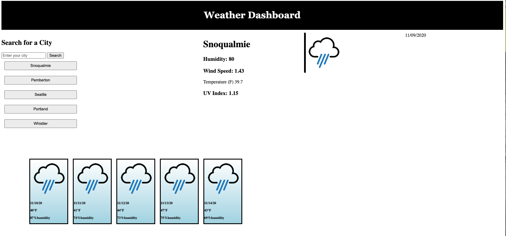

# Weather Dashboard

This application allows a user to enter a city or click on one of the defualt cities to see the weather for the current day as well as a 5 day forecast. The app lists the humidity, wind speed, temperature and UV index.

## Table of Contents 

- [Technologies](#tech)
- [Instalation](#install)
- [Usage](#output)
- [Contribute](#contribute)
- [Questions](#email)
- [License](#license)

### Technologies

 The technologies utilized in this application are as follows: , and HTML, JavaScript and CSS.

### Instalation

 To run this application successfully follow these steps:
  1. Install [WeatherAPI](https://erinmarie84.github.io/WeatherAPI/) to your local drive via terminal/GitBash. This will install the package.json file which contains a list of all the dependencies for this application. 

  2. Verify that node is installed on your computer by typing 'node' in your terminal/GitBash. If it returns
    >Welcome to Node.js V12.14.1 (or higher)
    >
    >Type '.help' for more information.

    Node.js is installed on your computer.
  3. Type 'npm install' in your terminal to install the dependencies. 

### Usage

 The purpose of this program is to solve Gives the user the ability to search the forecast for their chosen city.. The following is the expected output of the application: A user can enter a city into the search box and the weather for the current day and the next 5 days. If they enter in a second city the previous one will go into a list of cities and they can just click on that city to generate the weather information.

### Contribute
 
 Contrubutions are to this application are welcome to imporve it's functionality. If you would like to contribute to this application please contact me at the email address listed in the questions section.

### Questions

 Any questions and/or comments are welcome. Please contact me at e_marie84@ymail.com or visit my [Github Profile](https://github.com/erinmarie84)

 ### License

 Licensed under the MIT license. 
